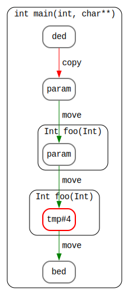

## Move Semantics & Perfect Forwarding: A Quantitive Approach


Readme provides a visual approach to understanding C++ Move Semantics and Perfect Forwarding. It explains how Move Semantics can be used to improve the performance of C++ code by avoiding unnecessary copying of objects, and how Perfect Forwarding can be used to ensure that arguments are correctly passed to functions.

### Move semantics

Below are simple examples to describe mnemonic diagrams rules.

Here *copy constructor* is called:
```cpp
   Int ded {};
   Int bed = ded;
```


Here *move constructor* is called:
```cpp
   Int ded {};
   Int bed = std::move(ded);
```


### Object of study

Let's look at a simple but very memorable example -- recursive call.
```cpp
   // foo returns passed object
   Int bed = foo(foo(ded));
```

We'll start with the lvalue implementation.
```cpp
Int foo(const Int &param) {
    return param; // << copy here
}

int main() {
   Int ded, bed;
   Int bed = foo(foo(ded));
}
```
We have a quite predictable diagram. The lvalue is copied here.


Then let's make things simple: pass argument by value.

```cpp
Int foo(Int param) {
    return param;
}

int main() {
   Int ded, bed;
   Int bed = foo(foo(ded)));
}
```
The diagram is a little bit tricky. Note that param is constructed inside main scope, and return value tmp#4 is constructed inside foo. We'll discuss diagram moves below.



### Is an rvalue reference an rvalue?

Lets speed up arguments evaluation with usage of *rvalue reference*.

```cpp
// Note rvalue reference argument type here
Int foo(Int &&param) {
    return param;
}

int main() {
   Int ded, bed;

   // Need to cast ded to rvalue before call
   Int bed = foo(foo(std::move(ded)));
}
```


Wait what?! Yeah... It slows down function. This is because param is *lvalue* inside foo function. That is why the *copy constructor* is called in the return expression.

```cpp
Int foo(Int &&param) {
    // param is lvalue here
    return param;
}
```

But why, when a parameter is passed by value, does it call the move constructor inside return statement? Because we already have implicit moves for local values and function parameters in a return statement.
```cpp
Int foo(Int param) {
    return param; // <- param is implicit rvalue here
}
```

### Perfect forwarding

### Compiler optimizations


