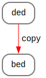
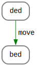

## Move Semantics & Perfect Forwarding: A Quantitive Approach


Readme provides a visual approach to understanding C++ Move Semantics and Perfect Forwarding. It explains how Move Semantics can be used to improve the performance of C++ code by avoiding unnecessary copying of objects, and how Perfect Forwarding can be used to ensure that arguments are correctly passed to functions.

### Move semantics

Let us start with simple example:

```cpp
   Int ded {};
   Int bed = ded;
```


```cpp
   Int ded {};
   Int bed = std::move(ded);
```


### Rvalue reference

### Is an rvalue reference an rvalue?

### Perfect forwarding

### Compiler optimizations


